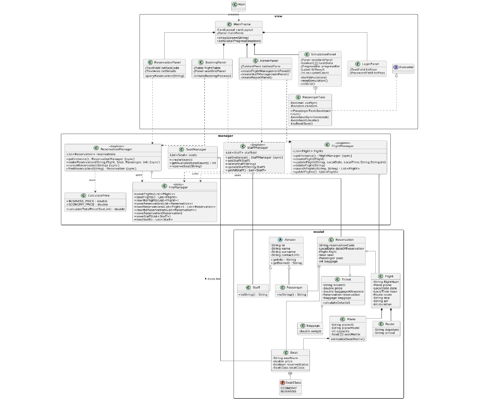

✈️ Airline Reservation and Management System
Bu proje, Yıldız Teknik Üniversitesi BLM1033 dersi kapsamında Java ile geliştirilmiş kapsamlı bir uçuş rezervasyon ve yönetim sistemidir.  Proje; Nesne Yönelimli Programlama (OOP) prensiplerini, Çoklu İş Parçacığı (Multithreading) kullanımını ve Birim Test (Unit Testing) süreçlerini uygulamalı olarak göstermektedir. 

🚀 Öne Çıkan Özellikler

GUI Tabanlı Yönetim: Java Swing ve CardLayout kullanılarak geliştirilen kullanıcı dostu arayüz. 

Gelişmiş Multithreading: * Senaryo 1: 90 yolcunun aynı anda koltuk ayırmasını simüle eden "Thread-Safe" rezervasyon sistemi. 

Senaryo 2: GUI'yi dondurmadan arka planda çalışan asenkron rapor oluşturma süreci. 

Veri Yönetimi: SQL yerine dosya tabanlı (File I/O) kalıcı depolama sistemi (flights.txt, reservations.txt, staff.txt). 

Tasarım Desenleri: Yönetici sınıflarında (Manager classes) Singleton pattern kullanımı. 

Kapsamlı Testler: JUnit 5 kullanılarak hazırlanmış 10 farklı birim testi. 

🛠️ Teknik Mimari
Proje dört ana modülden oluşmaktadır: 

Person Module: Abstract sınıflar kullanılarak oluşturulan Staff ve Passenger hiyerarşisi. 

Flight & Plane Module: Uçuşların, uçak modellerinin ve 2B koltuk matrisinin yönetimi. 

Reservation & Ticketing Module: Biletleme, bagaj limiti hesaplama ve fiyatlandırma mantığı. 

Management & Utility Module: Singleton yapısındaki yöneticiler ve dosya işleme birimleri. 

💻 Kullanılan Teknolojiler
Dil: Java

Arayüz: Java Swing (GUI)

Test: JUnit 5

Depolama: File I/O (Semicolon-separated values) 

📦 Kurulum ve Çalıştırma
Depoyu klonlayın:

Bash
git clone https://github.com/zehraheray/airline_managment_system.git
Proje ana dizinine gidin ve derleyin:

Bash
javac -d bin src/*.java
Uygulamayı çalıştırın:

Bash
java -cp bin Main
👥 Geliştiriciler

Zehra HERAY - 

Büşra ULUKUŞ -

